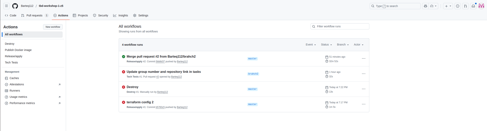
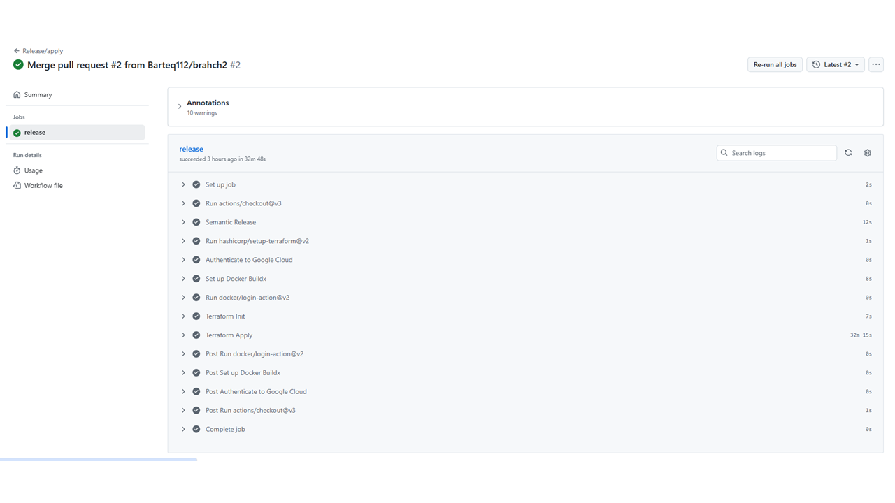
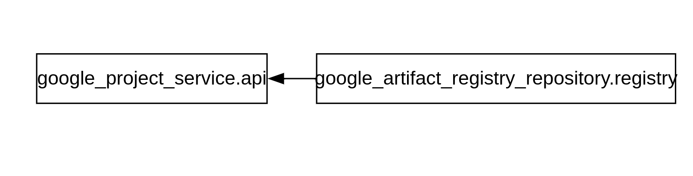
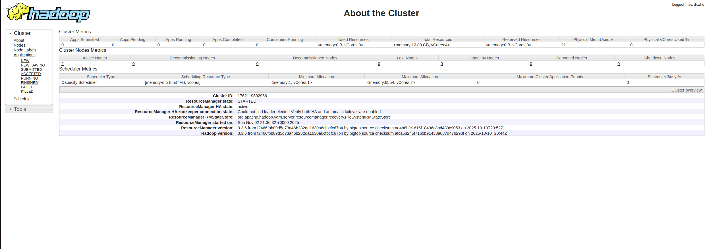
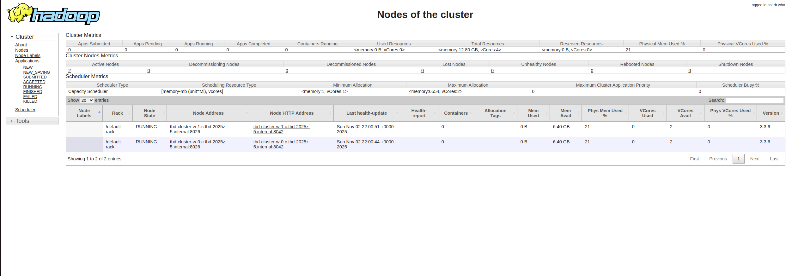
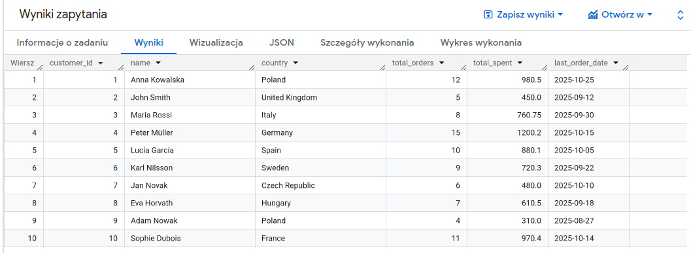

IMPORTANT ❗ ❗ ❗ Please remember to destroy all the resources after each work session. You can recreate infrastructure by creating new PR and merging it to master.
  

1. Group: ***5***  
   Authors:
   Bartosz Sędzikowski 
   Julian Żebrecki 
   Oskar Gorgis 
   ***https://github.com/Barteq112/tbd-workshop-1-z5/blob/master/tasks-phase1.md*** 
   ***https://github.com/Barteq112/tbd-workshop-1-z5/***   
3. Follow all steps in README.md.

4. From avaialble Github Actions select and run destroy on main branch.
   
5. Create new git branch and:
    1. Modify tasks-phase1.md file.
    
    2. Create PR from this branch to **YOUR** master and merge it to make new release. 

  
    
    

6. Analyze terraform code. Play with terraform plan, terraform graph to investigate different modules.

   Moduł gcr
   
   Cel:
   Udostępnienie rejestrów obrazów Dockera w GCP wraz z włączeniem wymaganych API.

   Tworzone zasoby:
   - google_project_service.api - Ten zasób włącza Google Artifact Registry API w danym projekcie GCP i nadaje lokalną nazwę "api",
tak aby można było tworzyć repozytoria Dockera i przechowywać obrazy kontenerów.
API pozostanie aktywne nawet po usunięciu infrastruktury Terraformem.
    - google_artifact_registry_repository.registry - Tworzy repozytorium Artifact Registry w regionie Europe (pod warunkiem że zostało utworzone api), z włączonym formatem Docker i pozwala nadpisywać tagi obrazów. Dodaje mu opis "TBD Docker repository" i ustawia typ na Dockera, któremu pozwala na nadpisywanie tagów.

   Zmienne na wejściu:
   - project_name (nazwa projektu)
   - location (lokacja, domyślnie ustawiana na EU)
  
   Wymagania:
     - Terraform - 1.11.0
     - google - 5.44.0

   Wyjścia:
     - registry_hostname - zwraca nazwę rejestru kontenerów GCP
     
   
   
7. Reach YARN UI
   (wykonujemy wszystko w terminalu linux)
   Po poprawnym zalgowoaniu używając komendy: gcloud auth login
   Oraz po zakończeniu wykonania Terraform, należy wpisać poniższą komendę.
   Komenda:
   gcloud compute ssh tbd-cluster-m --project tbd-2025z-5 --zone europe-west1-b --tunnel-through-iap -- -N -L 8088:localhost:8088

   
   
   
9. Draw an architecture diagram (e.g. in draw.io) that includes:
    1. Description of the components of service accounts
    2. List of buckets for disposal
    
    ***place your diagram here***

10. Create a new PR and add costs by entering the expected consumption into Infracost
For all the resources of type: `google_artifact_registry`, `google_storage_bucket`, `google_service_networking_connection`
create a sample usage profiles and add it to the Infracost task in CI/CD pipeline. Usage file [example](https://github.com/infracost/infracost/blob/master/infracost-usage-example.yml)

We used infracost-usage.yml file to define the expected consumption. The file is located in the root directory of the project. Content (note: the values are only for example purposes):
<pre> version: 0.1

resource_usage:

google_artifact_registry_repository.my_artifact_registry:
    storage_gb: 0.7 # Total data stored in the repository in GB
    monthly_egress_data_transfergb: # Monthly data delivered from the artifact registry repository in GB. You can specify any number of Google Cloud regions below, replacing - for  e.g.:
      europe_west1: 100 # GB of data delivered from the artifact registry to europe-west1.
google_storage_bucket.my_storage_bucket:
    storage_gb: 150                   # Total size of bucket in GB.
    monthly_class_a_operations: 40000 # Monthly number of class A operations (object adds, bucket/object list).
    monthly_class_b_operations: 20000 # Monthly number of class B operations (object gets, retrieve bucket/object metadata).
    monthly_data_retrieval_gb: 500    # Monthly amount of data retrieved in GB.
    monthly_egress_data_transfer_gb:  # Monthly data transfer from Cloud Storage to the following, in GB:
      same_continent: 550  # Same continent.
      worldwide: 12500     # Worldwide excluding Asia, Australia.
      asia: 0              # Asia excluding China, but including Hong Kong.
      china: 0              # China excluding Hong Kong.
      australia: 0        # Australia.
google_service_networking_connection.my_connection:
    monthly_egress_data_transfer_gb: # Monthly VM-VM data transfer from VPN gateway to the following, in GB:
      same_region: 250               # VMs in the same Google Cloud region.
      us_or_canada: 0              # From a Google Cloud region in the US or Canada to another Google Cloud region in the US or Canada.
      europe: 70                      # Between Google Cloud regions within Europe.
      asia: 0                       # Between Google Cloud regions within Asia.
      south_america: 0             # Between Google Cloud regions within South America.
      oceania: 0                     # Indonesia and Oceania to/from any Google Cloud region.
      worldwide: 0                 # to a Google Cloud region on another continent. </pre>
      
Infracost output assuming usage above:
<pre> Project: mlops
Module path: mlops

 Name                                                                                               Monthly Qty  Unit                      Monthly Cost   
                                                                                                                                                          
 module.gcp_mlflow_appengine.google_sql_database_instance.mlflow_cloudsql_instance                                                                        
 ├─ SQL instance (db-g1-small, zonal)                                                                       730  hours                           $25.55   
 ├─ Storage (SSD, zonal)                                                                                     10  GB                               $1.70   
 └─ Backups                                                                                  Monthly cost depends on usage: $0.08 per GB                  
                                                                                                                                                          
 module.gcp_mlflow_appengine.google_secret_manager_secret_version.mlflow_db_password_secret                                                               
 ├─ Active secret versions                                                                                    1  versions                         $0.06   
 └─ Access operations                                                                        Monthly cost depends on usage: $0.03 per 10K requests        
                                                                                                                                                          
 module.gcp_mlflow_appengine.google_secret_manager_secret.mlflow_db_password_secret                                                                       
 ├─ Active secret versions                                                                   Monthly cost depends on usage: $0.06 per versions            
 ├─ Access operations                                                                        Monthly cost depends on usage: $0.03 per 10K requests        
 └─ Rotation notifications                                                                   Monthly cost depends on usage: $0.05 per rotations           
                                                                                                                                                          
 module.gcp_mlflow_appengine.google_service_networking_connection.private_vpc_connection                                                                  
 └─ Network egress                                                                                                                                        
    ├─ Traffic within the same region                                                        Monthly cost depends on usage: $0.02 per GB                  
    ├─ Traffic within the US or Canada                                                       Monthly cost depends on usage: $0.02 per GB                  
    ├─ Traffic within Europe                                                                 Monthly cost depends on usage: $0.02 per GB                  
    ├─ Traffic within Asia                                                                   Monthly cost depends on usage: $0.08 per GB                  
    ├─ Traffic within South America                                                          Monthly cost depends on usage: $0.14 per GB                  
    ├─ Traffic to/from Indonesia and Oceania                                                 Monthly cost depends on usage: $0.10 per GB                  
    └─ Traffic between continents (excludes Oceania)                                         Monthly cost depends on usage: $0.08 per GB                  
                                                                                                                                                          
 module.gcp_mlflow_appengine.google_storage_bucket.mlflow_artifacts_bucket                                                                                
 ├─ Storage (multi_regional)                                                                 Monthly cost depends on usage: $0.026 per GiB                
 ├─ Object adds, bucket/object list (class A)                                                Monthly cost depends on usage: $0.10 per 10k operations      
 ├─ Object gets, retrieve bucket/object metadata (class B)                                   Monthly cost depends on usage: $0.004 per 10k operations     
 └─ Network egress                                                                                                                                        
    ├─ Data transfer in same continent                                                       Monthly cost depends on usage: $0.02 per GB                  
    ├─ Data transfer to worldwide excluding Asia, Australia (first 1TB)                      Monthly cost depends on usage: $0.12 per GB                  
    ├─ Data transfer to Asia excluding China, but including Hong Kong (first 1TB)            Monthly cost depends on usage: $0.12 per GB                  
    ├─ Data transfer to China excluding Hong Kong (first 1TB)                                Monthly cost depends on usage: $0.23 per GB                  
    └─ Data transfer to Australia (first 1TB)                                                Monthly cost depends on usage: $0.19 per GB                  
                                                                                                                                                          
 module.gcp_registry.google_container_registry.registry                                                                                                   
 ├─ Storage (standard)                                                                       Monthly cost depends on usage: $0.026 per GiB                
 ├─ Object adds, bucket/object list (class A)                                                Monthly cost depends on usage: $0.05 per 10k operations      
 ├─ Object gets, retrieve bucket/object metadata (class B)                                   Monthly cost depends on usage: $0.004 per 10k operations     
 └─ Network egress                                                                                                                                        
    ├─ Data transfer in same continent                                                       Monthly cost depends on usage: $0.02 per GB                  
    ├─ Data transfer to worldwide excluding Asia, Australia (first 1TB)                      Monthly cost depends on usage: $0.12 per GB                  
    ├─ Data transfer to Asia excluding China, but including Hong Kong (first 1TB)            Monthly cost depends on usage: $0.12 per GB                  
    ├─ Data transfer to China excluding Hong Kong (first 1TB)                                Monthly cost depends on usage: $0.23 per GB                  
    └─ Data transfer to Australia (first 1TB)                                                Monthly cost depends on usage: $0.19 per GB                  
                                                                                                                                                          
 Project total                                                                                                                                   $27.31   

 OVERALL TOTAL                                                                                                                                  $27.31 

*Usage costs were estimated using infracost-usage.yml, see docs for other options.

──────────────────────────────────
92 cloud resources were detected:
∙ 13 were estimated
∙ 75 were free
∙ 4 are not supported yet, rerun with --show-skipped to see details

┏━━━━━━━━━━━━━━━━━━━━━━━━━━━━━━━━━━━━━━━━━━━━━━━━━━━━┳━━━━━━━━━━━━━━━┳━━━━━━━━━━━━━┳━━━━━━━━━━━━┓
┃ Project                                            ┃ Baseline cost ┃ Usage cost* ┃ Total cost ┃
┣━━━━━━━━━━━━━━━━━━━━━━━━━━━━━━━━━━━━━━━━━━━━━━━━━━━━╋━━━━━━━━━━━━━━━╋━━━━━━━━━━━━━╋━━━━━━━━━━━━┫
┃ main                                               ┃         $0.00 ┃       $0.00 ┃      $0.00 ┃
┃ bootstrap                                          ┃         $0.00 ┃       $0.00 ┃      $0.00 ┃
┃ cicd_bootstrap                                     ┃         $0.00 ┃       $0.00 ┃      $0.00 ┃
┃ mlops                                              ┃           $27 ┃       $0.00 ┃        $27 ┃
┗━━━━━━━━━━━━━━━━━━━━━━━━━━━━━━━━━━━━━━━━━━━━━━━━━━━━┻━━━━━━━━━━━━━━━┻━━━━━━━━━━━━━┻━━━━━━━━━━━━┛</pre>

11. Create a BigQuery dataset and an external table using SQL
    
    Kod do stworzenia Datasetu:
    <pre>
      CREATE SCHEMA test_dataset
      OPTIONS(location = 'EU');
    </pre>

    Kod do dodania zewnętrznej tabeli:
    <pre>
      CREATE OR REPLACE EXTERNAL TABLE 'tbd-2025z-5.test_dataset.customers_external'
      OPTIONS (
        format = 'CSV',
        uris = ['gs://tbd-2025z-5-data/customers.csv'],
        skip_leading_rows = 1,
        field_delimiter = ','
      );
    </pre>
    Kod do wyświetenia danych zapytania:
    <pre>
      SELECT * FROM 'tbd-2025z-5.test_dataset.customers_external'
    </pre>
    
   
    Pliki ORC mają metadane zapisane w pliku. W przeciwieństwie do takich formatów jak CSV czy JSON te nie potrzebują schematu, gdyż zawierają w sobie informacje o typie kolumn, nazwach kolumn, typie kompresji i podstawowych statystykach (np. min, max).
    
13. Find and correct the error in spark-job.py

    ***describe the cause and how to find the error***
    
    Skrypt został uruchomiony przez GCP Cloud Shell.
    Skrypt spark-job.py wskazywał na bucket o nazwie gs://tbd-2025z-9901-data/data/shakespeare/, aby zapisać wyniki za pomocą df.write.orc(). Spark nie mógł znaleźć podanego bucketa i zwrócił błąd:
    <pre> 
    py4j.protocol.Py4JJavaError: An error occurred while calling o96.orc.
    : com.google.cloud.hadoop.repackaged.gcs.com.google.api.client.googleapis.json.GoogleJsonResponseException: 404 Not Found
    POST https://storage.googleapis.com/upload/storage/v1/b/tbd-2025z-9901-data/o?ifGenerationMatch=0&uploadType=multipart
    {
      "code": 404,
      "errors": [
        {
          "domain": "global",
          "message": "The specified bucket does not exist.",
          "reason": "notFound"
        }
      ],
      "message": "The specified bucket does not exist."
    } 
    </pre>
    W konsoli GCP pojawił się komunikat o błędzie z nazwą brakującego bucketa. Po zmianie nazwy bucketa zadanie zakończyło się sukcesem.
    <pre>
    Job [599fe522712b47689edeed3c9a946361] finished successfully.
    done: true
    driverControlFilesUri: gs://tbd-2025z-5-dataproc-staging/google-cloud-dataproc-metainfo/5acb7508-bc6f-43ea-8e93-c3af504b8bf2/jobs/599fe522712b47689edeed3c9a946361/
    driverOutputResourceUri: gs://tbd-2025z-5-dataproc-staging/google-cloud-dataproc-metainfo/5acb7508-bc6f-43ea-8e93-c3af504b8bf2/jobs/599fe522712b47689edeed3c9a946361/driveroutput
    jobUuid: 02e3ef2b-a0d5-32a5-b035-a1085a6e1849
    placement:
      clusterName: tbd-cluster
      clusterUuid: 5acb7508-bc6f-43ea-8e93-c3af504b8bf2
    pysparkJob:
      mainPythonFileUri: gs://tbd-2025z-5-code/spark-job.py
    reference:
      jobId: 599fe522712b47689edeed3c9a946361
      projectId: tbd-2025z-5
    status:
      state: DONE
      stateStartTime: '2025-11-13T14:33:32.342647Z'
    statusHistory:
    - state: PENDING
      stateStartTime: '2025-11-13T14:31:14.637884Z'
    - state: SETUP_DONE
      stateStartTime: '2025-11-13T14:31:14.659482Z'
    - details: Agent reported job success
      state: RUNNING
      stateStartTime: '2025-11-13T14:31:14.880951Z'
    yarnApplications:
    - name: Shakespeare WordCount
      progress: 1.0
      state: FINISHED
      trackingUrl: http://tbd-cluster-m.c.tbd-2025z-5.internal.:8088/proxy/application_1763040807341_0010/
  </pre>

  Skrypt został uruchomiony za pomoca komendy:
  
  <pre>
  gcloud dataproc jobs submit pyspark   gs://tbd-2025z-5-code/spark-job.py   --cluster=tbd-cluster   --region=europe-west1
  </pre>
    
    
    

15. Add support for preemptible/spot instances in a Dataproc cluster

    ***place the link to the modified file and inserted terraform code***
    
16. Triggered Terraform Destroy on Schedule or After PR Merge. Goal: make sure we never forget to clean up resources and burn money.

Add a new GitHub Actions workflow that:
  1. runs terraform destroy -auto-approve
  2. triggers automatically:
   
   a) on a fixed schedule (e.g. every day at 20:00 UTC)
   
   b) when a PR is merged to main containing [CLEANUP] tag in title

Steps:
  1. Create file .github/workflows/auto-destroy.yml
  2. Configure it to authenticate and destroy Terraform resources
  3. Test the trigger (schedule or cleanup-tagged PR)
     
***paste workflow YAML here***

***paste screenshot/log snippet confirming the auto-destroy ran***

***write one sentence why scheduling cleanup helps in this workshop***
